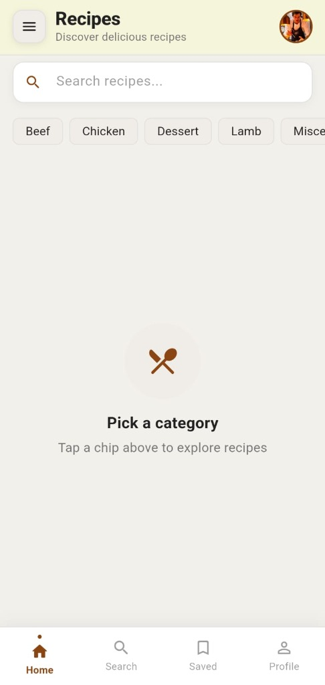
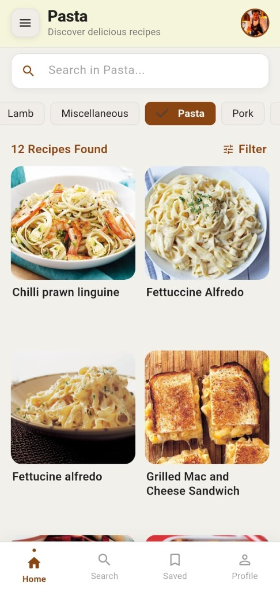
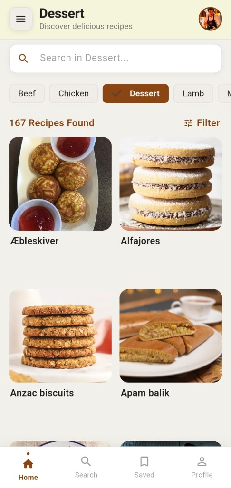

# Recipe App - Day 2 Task

Flutter application with API integration, category filtering, error handling, and search.

## Screenshots

| Pick a Category | Pasta Category | Dessert Category |
| :---: | :---: | :---: |
|  |  |  |

## Features

- **Category Filter:** Fetch categories dynamically and filter recipes.
- **Error Handling:** Dio client error handling using `Either<Failure, T>` from Dartz.
- **Search:** Instant search filtering per category.
- **Loading & UI:** Skeleton loading and clean error states.

## How to Run

```bash
flutter pub get
flutter run
```
